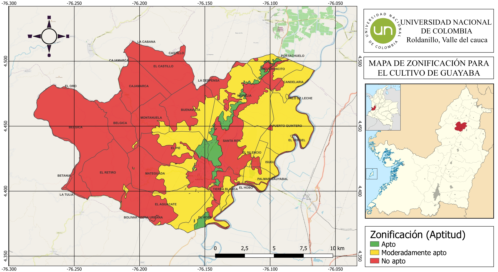
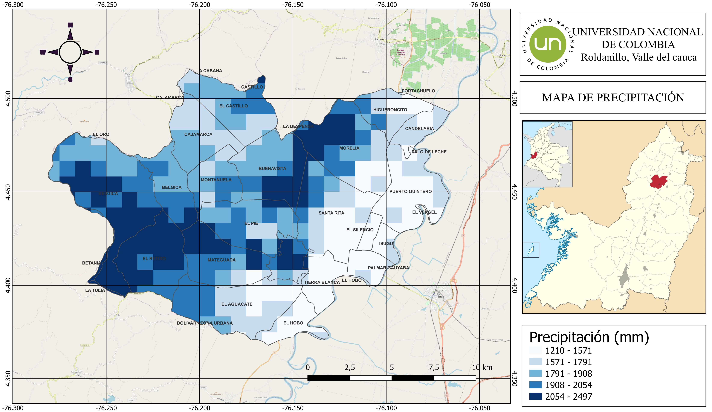
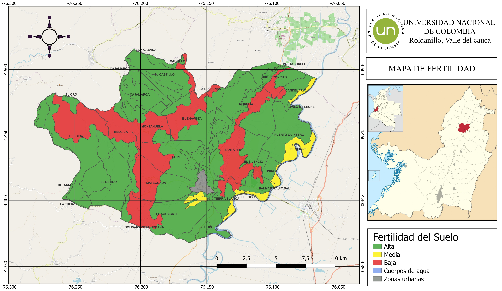

# StoryMap ArcGIS: Análisis Espacial en Agronomía 🌍🌱

Este proyecto es un StoryMap interactivo creado en ArcGIS Online para la planeación del proyecto productivo de guayaba (Psidium guajava, L.) en el municipio de Roldanillo, departamento de Valle del Cauca, Tolima se analizó las características edafoclimáticas de la zona, con la fisiología y los requerimientos del cultivo, con el fin de  determinar la aptitud de las diversas zonas del municipio para el establecimiento del mismo. 

La elaboración de mapas y el analisis de la información recopilada se hizo por medio del software QGIS 3.22 con división veredal como apoyo gráfico para el análisis. Análisis de las variables caracterizadas y su relación con la Ecofisiología del cultivo. Demuestra mis habilidades en GIS para narrar datos agrícolas de manera visual e interactiva.

## Enlace al StoryMap
[Ver el StoryMap en ArcGIS Online](https://storymaps.arcgis.com/stories/f81bc4768f5b48ca8a848ba13a5bc713)

## Objetivos
- Visualizar datos espaciales relacionados con variables edáficas y climáticas. 
- Integrar mapas, gráficos y narrativas para apoyar decisiones en agronomía.

## Tecnologías Usadas
- ArcGIS Online (StoryMaps para narrativas interactivas).
- Datos espaciales: Shapefiles, capas GIS.
- Análisis: Modelación espacial, visualización de datos.

## Proceso
1. **Recopilación de Datos:** Usé datos del IGAC y del IDEAM.
2. **Análisis Espacial:** Modelé la oferta edafoclimática de la zona para ver su aptitud con herramientas como QGIS.
3. **Creación del StoryMap:** Integré mapas interactivos, imágenes y texto para una narrativa fluida.
4. **Resultados:** Identificación de zonas aptas, moderadamente aptas y no aptas para el cultivo de Guayaba.

## Visualizaciones
Aquí algunos screenshots:

## Instrucciones para Explorar
- Accede al enlace arriba.

## Aprendizajes
Este proyecto mejoró mis habilidades en storytelling con GIS, aplicable a roles de Data Analyst en agricultura.
